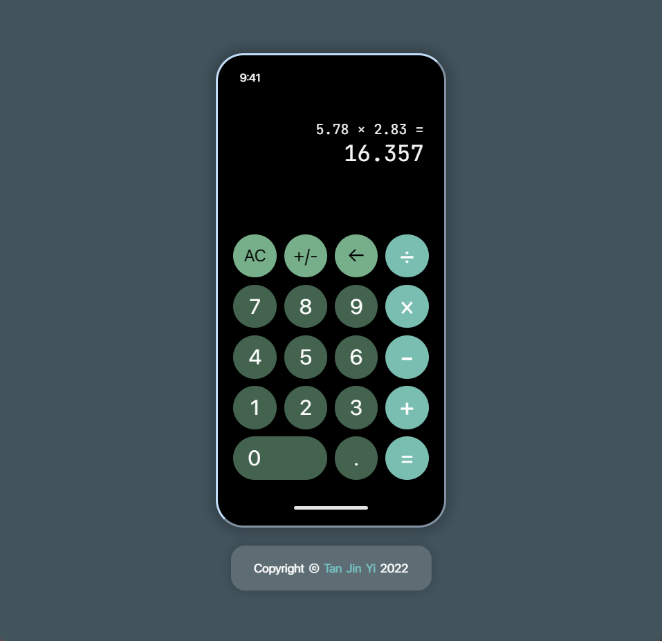

# Capstone Project #1 - Calculator

This is **Calculator**, an essential utility that has withstood the test of time.

## Live Preview

This project is hosted on **GitHub Pages**. Feel free to [:point_right: try it out](https://raineedust.github.io/capstone-calculator/)!

## Motivation and Goals

- [x] Elementary arithmetic operations
- [x] Multiple ops before equal
- [x] Change ops before equal
- [x] Evaluate only a single pair of numbers at a time
- [x] Round up long results and decimals
- [x] Implement negative numbers
- [x] Clear entire calculation
- [x] Warn of zero division, number limit
- [x] Warn of entering operators and equal before numbers
- [x] Operators won't register when entered w/o second operand
- [x] CSS: Implement display font scaling
- [x] CSS: Operation buttons different color from numbers
- [x] CSS: Implement with Grid and Flexbox
- [x] CSS: Implement modern-normalize
- [x] EXTRA CREDIT: Implement decimals
- [x] EXTRA CREDIT: Make it look nice
- [x] EXTRA CREDIT: Delete characters
- [x] EXTRA CREDIT: Implement keyboard shortcuts

## Resources

Below are a collection of resources which helped improve my skills :sparkles: while building the project:

- [if-else vs switch - javatpoint](https://www.javatpoint.com/if-else-vs-switch)
- [What properties can I use with event.target? - Stack Overflow](https://stackoverflow.com/questions/7723188/what-properties-can-i-use-with-event-target)
- [javascript - ReferenceError: Cannot access 'variable' before initialization - Stack Overflow](https://stackoverflow.com/questions/66976912/referenceerror-cannot-access-variable-before-initialization)
- [html - How to set min-font-size in CSS - Stack Overflow](https://stackoverflow.com/questions/23984629/how-to-set-min-font-size-in-css)
- [css - Font scaling based on width of container - Stack Overflow](https://stackoverflow.com/questions/16056591/font-scaling-based-on-width-of-container)
- [css - Remove blue underline from link - Stack Overflow](https://stackoverflow.com/questions/2789703/remove-blue-underline-from-link)
- [javascript - How to set an element's textContent, without the string getting trimmed? - Stack Overflow](https://stackoverflow.com/questions/48695754/how-to-set-an-elements-textcontent-without-the-string-getting-trimmed)
- [javascript - Check if a number has a decimal place/is a whole number - Stack Overflow](https://stackoverflow.com/questions/2304052/check-if-a-number-has-a-decimal-place-is-a-whole-number)
- [javascript - Get first word of string - Stack Overflow](https://stackoverflow.com/questions/18558417/get-first-word-of-string)
- [HTML data-\* Attribute](https://www.w3schools.com/tags/att_data-.asp)
- [KeyboardEvent.key - Web APIs | MDN](https://developer.mozilla.org/en-US/docs/Web/API/KeyboardEvent/key)

Built with :heart: to **The Odin Project**, a wonderful Web Development curriculum ~
